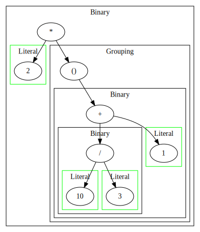
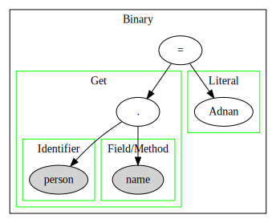

# CSLox

A CSharp implementation of an Interpreter for an **OOP** Language called [*Lox*](https://craftinginterpreters.com/the-lox-language.html)

## Quick Start

```console
$ ./scripts/run.sh
```

## Ahead of time (AoT) Compilation

```console
$ ./scripts/publish.sh
$ ./cslox/CSLox
```

## Tests

All test files are copied from [CraftingInterpreters Repository](https://github.com/munificent/craftinginterpreters/tree/master?tab=License-1-ov-file) and sperated into `passing tests` for tests that should pass & `failing tests` for tests that should fail

### Run tests

```console
$ ./scripts/test-passing.sh
$ ./scripts/test-failing.sh
```

### Print the AST for any Expression

#### Example 1

```console
$ ./scripts/run.sh -p:DefineConstants=PRINT_AST

(prompt)> print 2 * (10 / 3 + 1);
[DEBUG]	AST
	digraph AST{subgraph cluster_1{label="Binary";expr_1[label="*"];expr_1->expr_2;subgraph cluster_2{color=green;node[style=filled];label="Literal";expr_2[label="2"];}expr_1->expr_3;subgraph cluster_3{label="Grouping";expr_3[label="()"];expr_3->expr_4;subgraph cluster_4{label="Binary";expr_4[label="+"];expr_4->expr_5;subgraph cluster_5{label="Binary";expr_5[label="/"];expr_5->expr_6;subgraph cluster_6{color=green;node[style=filled];label="Literal";expr_6[label="10"];}expr_5->expr_7;subgraph cluster_7{color=green;node[style=filled];label="Literal";expr_7[label="3"];}}expr_4->expr_8;subgraph cluster_8{color=green;node[style=filled];label="Literal";expr_8[label="1"];}}}}}
```

then you can go to [`this website`](https://dreampuf.github.io/GraphvizOnline) and past the digraph in, and you will get this result:



#### Example 2

```console
$ ./scripts/run.sh -p:DefineConstants=PRINT_AST
(prompt)> class Person {}
(prompt)> var person = Person();
(prompt)> person.name = "Adnan";
[DEBUG]	AST
	digraph AST{subgraph cluster_1{label="Binary";expr_1[label="="];expr_1->expr_2;subgraph cluster_2{color=green;node[style=filled];label="Get";expr_2[label="."];expr_2->expr_3;subgraph cluster_3{color=green;node[style=filled];label="Identifier";expr_3[label="person"];}expr_2->expr_4;subgraph cluster_4{color=green;node[style=filled];label="Field/Method";expr_4[label="name"];}}expr_1->expr_5;subgraph cluster_5{color=green;node[style=filled];label="Literal";expr_5[label="Adnan"];}}}
(prompt)> 
```

